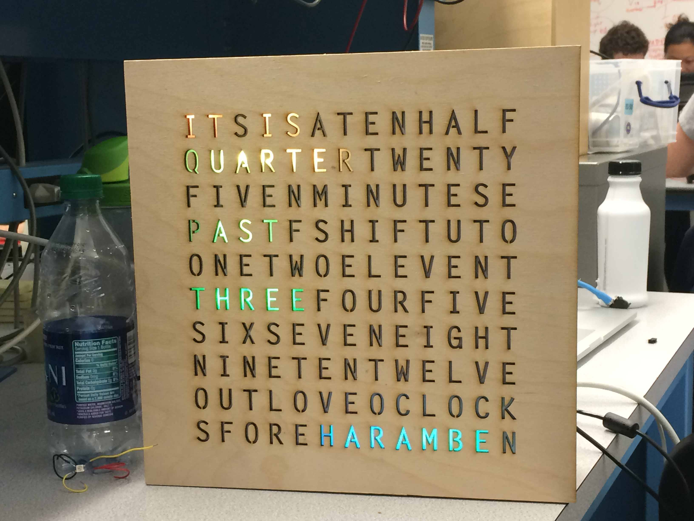
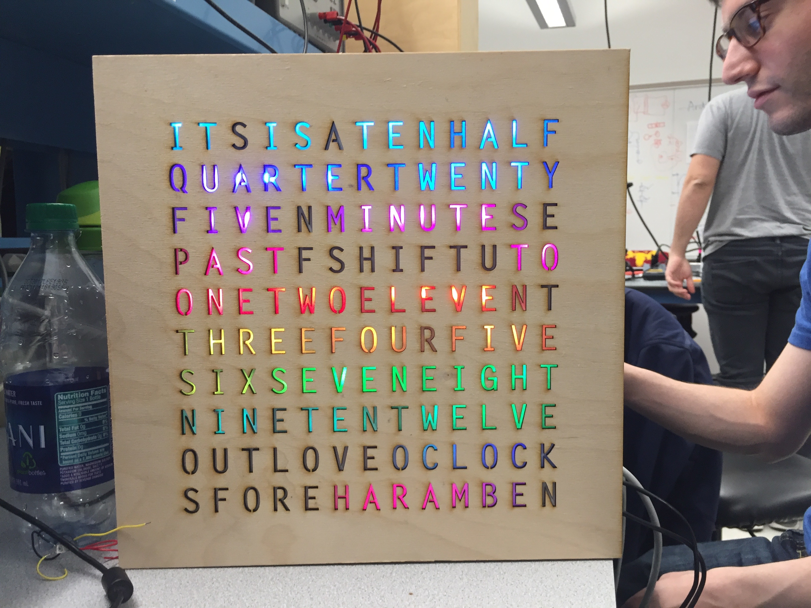

# Backlit Word Clock
An arduino-powered clock that tells the time by lighting up cut-outs of words with a rainbow LED strip.

[Watch the video!](https://www.youtube.com/watch?v=HvfSM3tTWjE&feature=youtu.be)